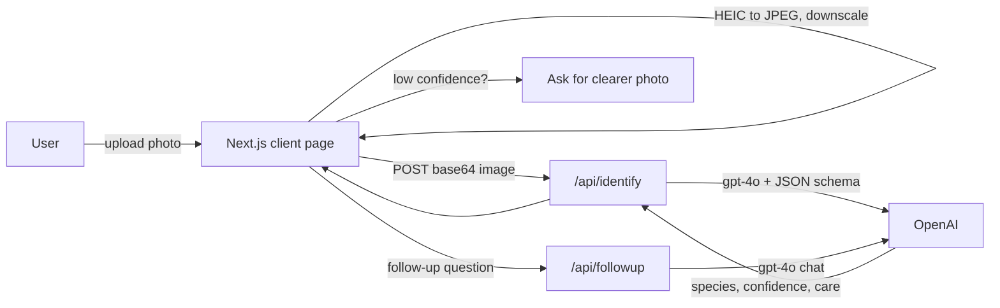

# PlantCare AI — Technical Design (v0.1)

This document records the technical design decisions for PlantCare AI: a web app where a user uploads a plant photo and an AI agent identifies the species and returns tailored care instructions. See [REQUIREMENTS.md](REQUIREMENTS.md) for product scope.

## Decision summary

| Area | Decision | Why |
| --- | --- | --- |
| Framework | Next.js 15 (App Router, TypeScript, React 19) | One project serves the UI and serverless API routes; keeps the AI key server-side; fast to start. |
| AI provider | OpenAI `gpt-4o` vision via official `openai` SDK | User already has a key; strong multimodal vision; minimal setup. |
| Structured output | OpenAI Structured Outputs (JSON schema) | Reliable parsing of species/confidence/care fields instead of free-text scraping. |
| Styling | Hand-written CSS implementing the Blend design system | Blend is a design convention (palette, type, shadows), not an npm package. |
| Persistence | None (in-memory React state) | v0.1 has no accounts, history, or reminders. |
| Auth | None | Out of scope for v0.1. |
| Platform | Web only | Per requirements. |

## Architecture



The browser handles image preparation (format conversion, downscaling) and rendering. All OpenAI calls go through Next.js API routes so the `OPENAI_API_KEY` is never exposed to the client.

## Key decisions and rationale

### 1. Full-stack Next.js over a separate SPA + backend
A single Next.js app provides serverless API routes alongside the React UI. This avoids running and deploying two services, and lets us keep the OpenAI key on the server with zero extra infrastructure. Trade-off: we are coupled to the Next.js/Vercel-style deployment model, which is acceptable for v0.1.

### 2. OpenAI GPT-4o with Structured Outputs
The agent must return discrete, predictable fields (species, confidence, and four care categories). Using a JSON schema with Structured Outputs makes the response machine-parseable and removes brittle text parsing. The identify schema is:

```
{
  isPlant: boolean,
  species: string,        // scientific name
  commonName: string,
  confidence: number,     // 0.0 - 1.0
  water: string,          // frequency & amount
  sunlight: string,       // level & hours
  soil: string,           // soil & fertilizer needs
  temperatureHumidity: string
}
```

### 3. Confidence and fallback flow
The model returns a `confidence` value (0–1) and an `isPlant` flag. The UI shows results only when `isPlant === true` and `confidence >= 0.5`. Otherwise it shows a fallback banner asking for a clearer photo. This satisfies both the confidence display and the graceful non-plant handling requirements.

### 4. Two API routes
- `POST /api/identify` — takes a base64 image, calls `gpt-4o` with the prompt + JSON schema, returns the structured result.
- `POST /api/followup` — takes the identified species plus prior messages and a new question, returns a plant-specific answer.

Splitting identification from Q&A keeps each route's prompt focused and the contract simple.

### 5. Image handling (JPEG / PNG / HEIC)
JPEG and PNG are sent directly. HEIC (common from iOS) is converted to JPEG **client-side with `heic2any`** because browsers and the vision API do not reliably accept HEIC. Large images are downscaled on a canvas before upload to keep request payloads and token costs low.

### 6. Blend design system as CSS
Blend defines a warm stone palette, IBM Plex Sans + Crimson Pro typography, soft shadows (no borders), slow transitions, and a `data-theme` dark mode. We implement these as CSS variables and global styles rather than importing a library, since Blend ships only as a design specification.

## Component layout

- `app/page.tsx` — orchestrates upload, results, and chat state.
- `UploadZone` — drag/drop, file picker, mobile camera capture, preview, HEIC conversion, downscale.
- `ResultCard` + `ConfidenceBadge` — species, common name, confidence.
- `CareInstructions` — water, sunlight, soil & fertilizer, temperature & humidity.
- `FollowUpChat` — chat UI wired to `/api/followup`.
- `ThemeToggle` — light/dark via `data-theme`.

## Configuration

- `OPENAI_API_KEY` stored in `.env.local` (gitignored); documented in `.env.example`.
- No database, no other secrets.

## Out of scope (v0.1)

Disease/pest diagnosis, care reminders/notifications, multi-plant detection, accounts/auth, and persistence — all deferred per requirements.

## Dependencies and licenses

| Package | License | Commercial use |
| --- | --- | --- |
| next, react | MIT | Yes |
| openai | Apache-2.0 | Yes |
| heic2any | MIT | Yes |

All dependencies are free for commercial use.
