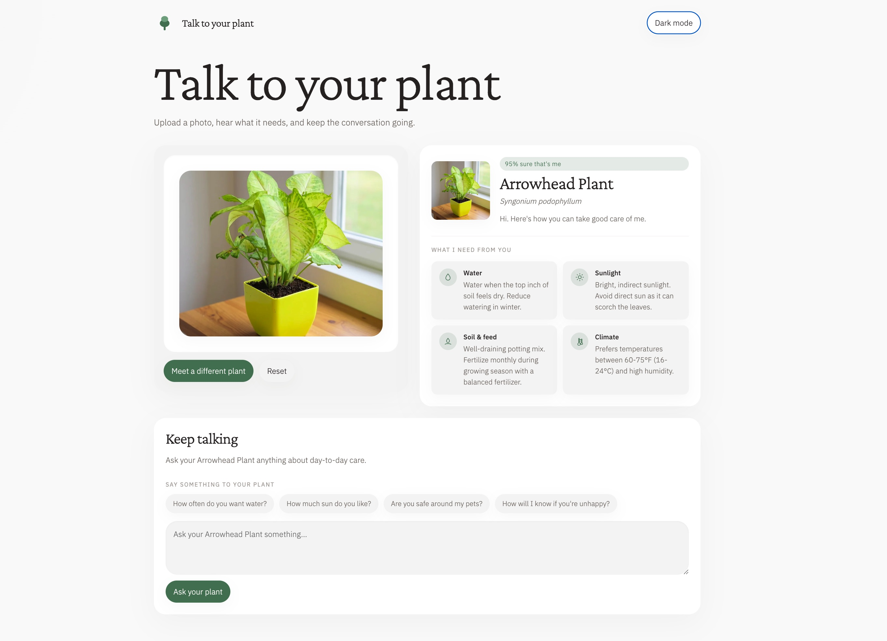

# PlantCare AI

PlantCare AI is a small Next.js web app that identifies a plant from a user-supplied image and returns tailored care instructions for water, sunlight, soil/fertilizer, and temperature/humidity.

## Preview



## Tech stack

- Next.js App Router with TypeScript
- OpenAI `gpt-4o` vision via the official `openai` SDK
- Hand-written CSS implementing the Blend design system
- Client-side HEIC conversion and image downscaling with `heic2any`

## Setup

1. Install dependencies:

   ```bash
   npm install
   ```

2. Copy `.env.example` to `.env.local` and add your OpenAI key:

   ```bash
   OPENAI_API_KEY=your_openai_api_key_here
   ```

3. Start the development server:

   ```bash
   npm run dev
   ```

4. Open the local URL printed by Next.js and upload a clear image of one plant.

## How it works

- The browser converts HEIC images to JPEG when needed and downscales large images before upload.
- `POST /api/identify` sends the image to OpenAI and asks for a structured JSON response containing the plant identity, confidence, and care fields.
- Low-confidence or non-plant responses show a clearer-photo fallback instead of care results.
- `POST /api/followup` answers plant-specific care questions using the identified plant context.

## Scope

Included in v0.1: image upload, plant identification, care instructions, confidence/fallback handling, follow-up Q&A, JPEG/PNG/HEIC support, and Blend styling.

Out of scope in v0.1: accounts, history, reminders, disease or pest diagnosis, and multi-plant detection.
